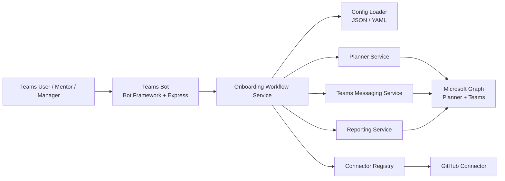

# BotTeams Onboarding POC

POC Microsoft Teams pour structurer l'onboarding des nouveaux arrivants chez EPITECH. La solution privilégie un socle simple en Node.js + TypeScript avec Microsoft Bot Framework pour le bot Teams et Microsoft Graph pour Teams et Planner.

## Architecture



### Composants

- `Teams Bot`: point d'entrée conversationnel pour Teams, avec réponses simples (`help`, `status`) et extension future vers des commandes métier.
- `Onboarding Workflow Service`: orchestre le message de bienvenue, la création des quêtes Planner, le maintien de 5 quêtes actives maximum et le déblocage des missions par catégorie.
- `Planner Service`: encapsule l'accès Graph pour lister, créer et clôturer les tâches Planner.
- `Teams Messaging Service`: crée un chat Teams entre mentor et onboardé puis envoie les notifications.
- `Reporting Service`: produit un récapitulatif bimensuel et l'envoie au manager.
- `Connector Registry`: point d'extension pour GitHub ou d'autres intégrations.

## Structure du projet

```text
.
├── configs/
│   ├── onboarding.sample.json
│   ├── onboarding.sample.json
│   └── onboarding.sample.yaml
├── src/
│   ├── bot/
│   │   └── teamsOnboardingBot.ts
│   ├── config/
│   │   └── env.ts
│   ├── connectors/
│   │   ├── baseConnector.ts
│   │   └── githubConnector.ts
│   ├── graph/
│   │   └── graphClient.ts
│   ├── models/
│   │   └── onboarding.ts
│   ├── routes/
│   │   └── onboardingRoutes.ts
│   ├── services/
│   │   ├── onboardingConfigLoader.ts
│   │   ├── onboardingWorkflowService.ts
│   │   ├── plannerService.ts
│   │   ├── reportingService.ts
│   │   └── teamsMessagingService.ts
│   ├── utils/
│   │   └── logger.ts
│   └── index.ts
├── .env.example
├── package.json
└── tsconfig.json
```

## Mise en route

```bash
npm install
cp .env.example .env
npm run dev
```

Node.js 20 est recommandé en cible Azure pour éviter les warnings de compatibilité des dépendances Microsoft récentes. Le projet reste vérifiable en Node 18 pour ce POC, mais le déploiement doit viser Node 20 LTS.

## Installation Teams locale

Pour installer le bot dans Teams et le tester en local, ajoutez un tunnel HTTP public vers le port `3978`, puis générez le package Teams.

1. Démarrer le bot en local avec `npm run dev`.
2. Exposer le port `3978` avec `devtunnel host -p 3978 --allow-anonymous` ou `ngrok http 3978`.
3. Reporter le domaine public sans `https://` dans `PUBLIC_HOSTNAME` dans `.env`.
4. Renseigner `BOT_APP_ID` avec l'App ID du bot Azure et, si besoin, `TEAMS_APP_ID` avec un GUID dédié au manifeste Teams.
5. Générer l'archive installable avec `npm run package:teams`.
6. Importer `appPackage/build/botteams-onboarding-poc.zip` dans Teams via `Apps > Manage your apps > Upload a custom app`.
7. Ouvrir l'application et envoyer `help` pour valider que le bot répond.

Le manifeste généré cible par défaut les scopes `personal` et `team`.

Endpoints POC:

- `POST /api/onboarding/start`: démarre un onboarding complet.
- `POST /api/onboarding/sync`: vérifie les tâches complétées et réinjecte des tâches si besoin.
- `POST /api/onboarding/report`: envoie un reporting immédiat.
- `GET /healthz`: healthcheck.

Exemple de payload `POST /api/onboarding/start`:

```json
{
  "onboardingId": "onb-2026-001",
  "onboardee": {
    "aadUserId": "11111111-1111-1111-1111-111111111111",
    "displayName": "Alice Martin",
    "email": "alice.martin@epitech.eu",
    "role": "Developer",
    "team": "Plateforme"
  },
  "mentor": {
    "aadUserId": "22222222-2222-2222-2222-222222222222",
    "displayName": "Bob Mentor",
    "email": "bob.mentor@epitech.eu"
  },
  "manager": {
    "aadUserId": "33333333-3333-3333-3333-333333333333",
    "displayName": "Claire Manager",
    "email": "claire.manager@epitech.eu"
  },
  "planId": "planner-plan-id",
  "teamId": "teams-team-id"
}
```

## Format du catalogue

Le catalogue d'onboarding est maintenant structuré autour de catégories, quêtes et missions.

- `defaultActiveQuestLimit`: nombre maximum de quêtes actives simultanément pour un onboardé.
- `categories[].quests[]`: quêtes courtes, validées automatiquement ou via Jenkins.
- `categories[].missions[]`: objectifs plus longs, débloqués après 3 quêtes validées dans la catégorie, puis validés par un mentor.

Le fichier de référence prêt à l'emploi est `configs/onboarding.sample.json`.

## Choix techniques

- `Bot Framework` plutôt que Teams Toolkit pour limiter les abstractions et garder un POC lisible.
- `Graph API` pour Teams et Planner, centralisé via des services testables.
- `Polling cron` pour la détection de complétion Planner dans le POC: plus simple à mettre en place que des webhooks et suffisant pour valider la logique métier.
- `Connectors` sous forme d'interface afin d'ajouter GitHub, Jira ou d'autres sources sans toucher à l'orchestrateur principal.

## Déploiement Azure

### Option 1: Azure App Service

Adapté si vous voulez héberger le bot et les tâches planifiées dans le même processus Node.js.

1. Créer une App Registration Azure AD pour le bot.
2. Créer une seconde App Registration ou réutiliser la même pour Graph avec permissions applicatives.
3. Déployer l'application Node.js sur App Service.
4. Configurer les variables d'environnement de `.env.example` dans App Service.
5. Déclarer l'URL publique du bot dans Azure Bot Service: `https://<host>/api/messages`.
6. Installer l'application Teams dans le tenant cible.

### Option 2: Azure Functions + Timer

Adapté si vous voulez séparer:

- le bot HTTP sur App Service,
- la synchro Planner et le reporting bimensuel sur Azure Functions Timer.

Pour un POC, App Service seul reste le plus simple.

## Configuration Azure / Graph

Permissions Graph minimales à évaluer selon le tenant:

- `Chat.Create`
- `Chat.ReadWrite`
- `Tasks.ReadWrite`
- `Group.Read.All`
- `User.Read.All`
- `Mail.Send` si reporting par email

L'approche recommandée est l'authentification applicative via `ClientSecretCredential` ou, en production Azure, `Managed Identity`.

## Bonnes pratiques

- Valider toutes les variables d'environnement au démarrage.
- Séparer l'orchestration métier des appels Graph.
- Journaliser les appels externes avec corrélation (`onboardingId`, `taskId`).
- Prévoir des retries ciblés sur les erreurs transitoires Graph (`429`, `5xx`).
- Limiter les permissions Graph au strict nécessaire.
- Remplacer le secret client par une identité managée en production.
- Conserver les mappings `onboardingId -> planner task ids / chat id` dans une vraie base si le POC évolue.

## Limites POC assumées

- Le suivi d'état est en mémoire pour rester simple.
- Le reporting bimensuel est déclenché par cron local.
- La détection des tâches terminées repose sur une synchronisation planifiée.

Pour passer en production, ajoutez une base de données, une file de messages et un mécanisme d'idempotence sur les créations Graph.